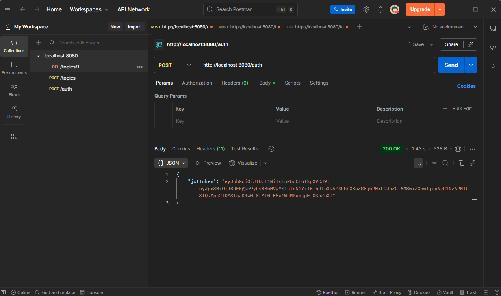
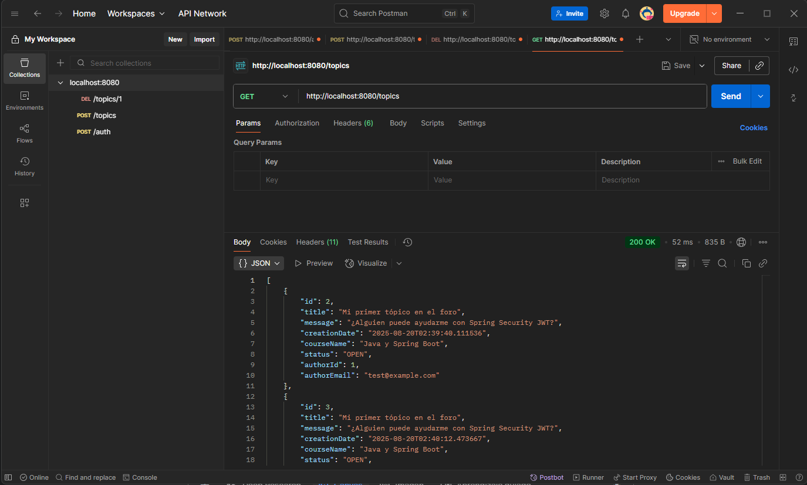
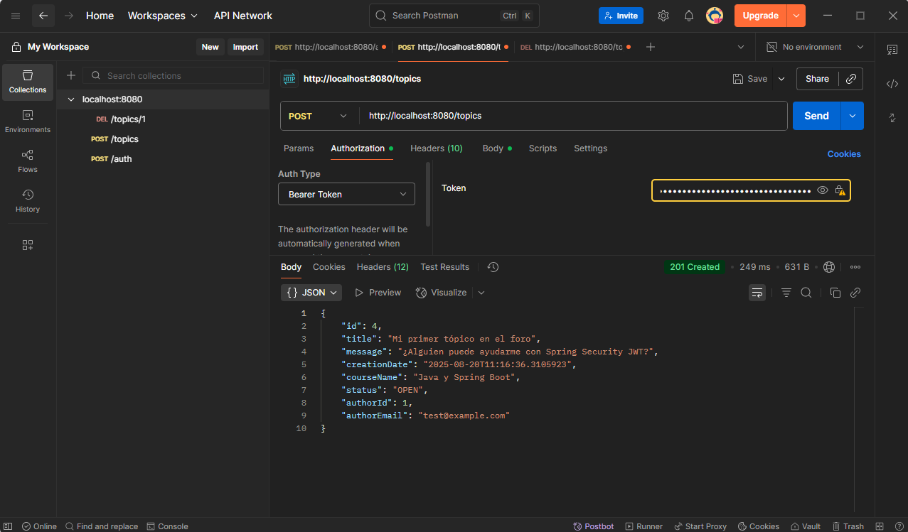
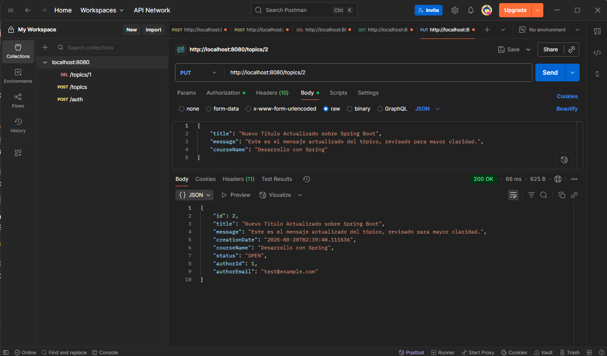
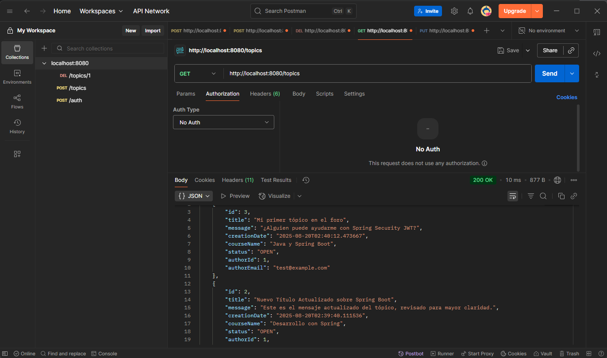
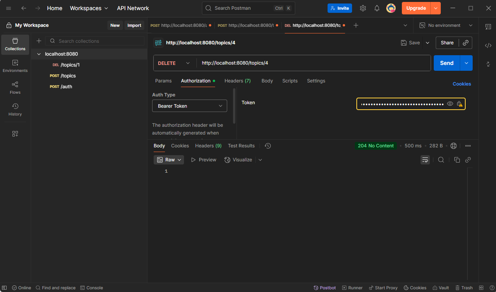

# 💬 API REST del Foro (Challenge Alura)

Este proyecto implementa una  **API REST para un foro** , desarrollada como parte del  *Challenge de Alura ONE* .

Permite a los usuarios registrarse, autenticarse, crear y gestionar tópicos de discusión.

La seguridad está implementada con **JWT (JSON Web Tokens)** para proteger los endpoints.

---

## 🌟 Características

* 🔑  **Autenticación de Usuarios** : Registro y login con email/contraseña → genera JWT.
* 📝  **Gestión de Tópicos** :
  * Crear nuevos tópicos (requiere autenticación).
  * Listar todos los tópicos (público).
  * Ver detalle de un tópico por ID (requiere autenticación).
  * Actualizar y eliminar tópicos (requiere autenticación).
* 🛡️  **Seguridad** : Spring Security con JWT.
* 🗄️  **Base de Datos** : PostgreSQL con Spring Data JPA.
* ✅ **Validación de Datos** con `jakarta.validation`.

---

## 🛠️ Tecnologías Utilizadas

* ☕ Java 17
* 🚀 Spring Boot 3.x (Web, Data JPA, Security, Validation, DevTools)
* 🗄️ PostgreSQL
* 📦 Maven
* 📝 Lombok
* 🔐 Auth0 java-jwt

---

## 🚀 Cómo Empezar

### 📌 Requisitos Previos

* JDK 17+
* Maven
* PostgreSQL (5432 por defecto)
* PgAdmin 4 (opcional)
* IDE (IntelliJ IDEA recomendado)
* Postman / Insomnia

---

### 1️⃣ Configuración de la Base de Datos

<pre class="overflow-visible!" data-start="1598" data-end="1792">

<code class="whitespace-pre! language-properties">spring.datasource.url=jdbc:postgresql://localhost:5432/foro_db
spring.datasource.username=postgres
spring.datasource.password=YOUR_PASSWORD

api.security.secret=YOUR_JWT_SECRET
</code>

</pre>

### 2️⃣ Insertar un Usuario Inicial

En la tabla `users` de la DB:

<pre class="overflow-visible!" data-start="1860" data-end="1944">

<code class="whitespace-pre! language-sql">email: test@example.com
password: <hash_bcrypt_de_tu_password>
role: USER
</code>

</pre>

### 3️⃣ Ejecutar la Aplicación

En IntelliJ → `ForumApplication.java` →  **Run** .

Se levanta en `http://localhost:8080`.

---

## 🗺️ Endpoints de la API

### 🔐 1. Autenticación

**POST** `http://localhost:8080/auth`

Body:

<pre class="overflow-visible!" data-start="2171" data-end="2240">

<code class="whitespace-pre! language-json">{
  "email":"test@example.com",
  "password":"123456"
}
</code>

</pre>

✅ Devuelve `jwtToken`.

📸 *Postman mostrando login y token devuelto*

---

### 🌍 2. Listar Tópicos

**GET** `http://localhost:8080/topics`

✅ Devuelve lista JSON.

📸 *Respuesta con lista de tópicos en Postman*

---

### ➕ 3. Crear Tópico

**POST** `http://localhost:8080/topics`

Headers: `Authorization: Bearer <JWT>`

Body:

<pre class="overflow-visible!" data-start="2613" data-end="2775">

<code class="whitespace-pre! language-json">{
  "title":"Duda sobre Spring Security",
  "message":"¿Cómo se gestionan los roles con JWT?",
  "courseName":"Desarrollo Backend",
  "userId":1
}
</code>

</pre>

📸 *Postman mostrando creación de tópico*

---

### 📌 4. Detalle de Tópico

**GET** `http://localhost:8080/topics/{id}`

Headers: `Authorization: Bearer <JWT>`

📸 *Postman mostrando detalle de un tópico*

---

### ✏️ 5. Actualizar Tópico

**PUT** `http://localhost:8080/topics/{id}`

📸 *Postman mostrando actualización exitosa*

---

### 🗑️ 6. Eliminar Tópico

**DELETE** `http://localhost:8080/topics/{id}`

📸 *Postman mostrando respuesta 204 No Content*

---

## 💡 Posibles Mejoras

* Estado de tópicos (`OPEN` / `CLOSED`).
* Respuestas personalizadas para errores (ej. 404).
* Registro de usuarios desde la API.
* Añadir modelo de **Respuestas** a los tópicos.

---

## 🤝 Contribuciones

¡Bienvenidas las ideas y mejoras! 🎉

Abre un **issue** o un  **pull request** .

---

## 📄 Licencia

Proyecto bajo  **Licencia MIT** .
